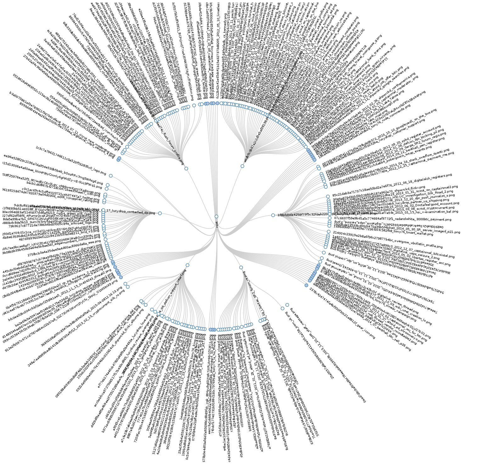

# Solr Similarity
This project offers solution for computing similarity between solr results in n dimensional vector space.
# Highlights :
+ It works on top of Apache Spark (a custom Spark RDD is implmeted to easily import Solr results to Spark) 
+ Configurable vectorizers. The default implementation emphasises more on field names rathen than field values. (Advanced one is in TODO: list ).
+ Configurable Similarity measures. The default one is based on cosine simularity.


## Requirements
+ Maven 3.x
+ JDK 1.8.x
+ Spark (Fetched from maven repo)


## Build :
+ to compile : `mvn clean compile`
+ to build : `mvn clean package`

## to run :
+ __Usage__
```
$ java -jar target/solr-similarity-1.0-SNAPSHOT.jar
     -format [csv | cluster] : Output format (default: csv)
     -master VAL             : spark master name or url (default: local)
     -measure [cosine]       : name of similarity measure to use (default: cosine)
     -out FILE               : path to directory for storing the output
     -query VAL              : Solr query for selecting the documents (default: *:*)
     -solr URL               : Solr URL
     -threshold N            : threshold for treating documents as similar
                               (default: 0.9)
     -vectorizer [simple]    : name of vectorizer to use (default: simple)

```

+ __Example__
 to find similarity between documents matching to query "flash"

```
 java -jar target/solr-similarity-1.0-SNAPSHOT.jar \
    -solr http://localhost:8983/solr/collection1 \
    -query "flash" \
    -out cos-similarity.csv
    -format csv  #For CSV file

java -jar target/solr-similarity-1.0-SNAPSHOT.jar \
    -solr http://localhost:8983/solr/collection1 \
    -query "flash" \
    -out clusters.json
    -format cluster #For Clusters JSON file
```
## Screen Shots:
+ Clusters with 90% similarity threshold on a small test data :
    
